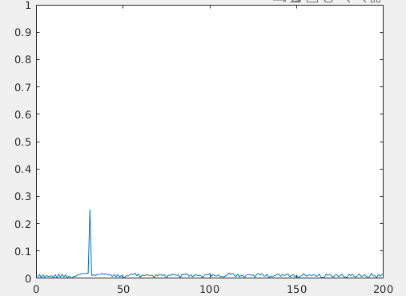
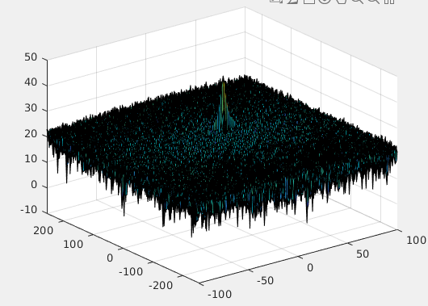
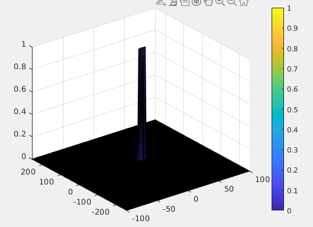

# SFND_Radar_Detection
## Project Layout


## Project specification

### FMCW Waveform Design
*Using the given system requirements, design a FMCW waveform. Find its Bandwidth (B), chirp time (Tchirp) and slope of the chirp.*

Slope (alpha) value: 2.0455e+13

```
% *%TODO* :
%Design the FMCW waveform by giving the specs of each of its parameters.
% Calculate the Bandwidth (B), Chirp Time (Tchirp) and Slope (slope) of the FMCW
% chirp using the requirements above.
Rmax = 200;
dr = 1;
c = 3 * 10^8;
Bsweep = c / 2 * dr;
Tchirp = 5.5 * 2 * Rmax / c;
alpha = Bsweep / Tchirp; % Slope
```

### Simulation Loop
*Simulate Target movement and calculate the beat or mixed signal for every timestamp.*

A beat signal is generated. FFT transformation of given signal has correct initial position - d0 = 30;.

```
for i=1:length(t)         
    % *%TODO* :
    %For each time stamp update the Range of the Target for constant velocity. 
    r_t(i) = d0 + v0 * t(i);
    td(i) = 2 * r_t(i) / c;
    
    % *%TODO* :
    %For each time sample we need update the transmitted and
    %received signal. 
    Tx(i) = cos(2 * pi * (fc * t(i) + (alpha * t(i)^2) / 2));
    Rx(i) = cos(2 * pi * (fc * (t(i) - td(i)) + alpha * ((t(i) - td(i)) ^ 2) / 2.0));
    
    % *%TODO* :
    %Now by mixing the Transmit and Receive generate the beat signal
    %This is done by element wise matrix multiplication of Transmit and
    %Receiver Signal
    Mix(i) = Tx(i) .* Rx(i);
    
end
```

### Range FFT (1st FFT)
*Implement the Range FFT on the Beat or Mixed Signal and plot the result.*

Implementation has peak at initial position.



```
 % *%TODO* :
%reshape the vector into Nr*Nd array. Nr and Nd here would also define the size of
%Range and Doppler FFT respectively.
Mix_matrix = reshape(Mix, Nr, Nd);

 % *%TODO* :
%run the FFT on the beat signal along the range bins dimension (Nr) and
%normalize.
f = fft(Mix_matrix, Nr);
f_norm = f / Nr;

 % *%TODO* :
% Take the absolute value of FFT output
f_abs = abs(f_norm);

 % *%TODO* :
% Output of FFT is double sided signal, but we are interested in only one side of the spectrum.
% Hence we throw out half of the samples.
f_one_side = f_abs(1:Nr/2);

%plotting the range
figure ('Name','Range from First FFT')
subplot(1,1,1)

 % *%TODO* :
 % plot FFT output 
plot(f_one_side);
axis ([0 200 0 1]);
```

### 2D CFAR
Implement the 2D CFAR process on the output of 2D FFT operation, i.e the Range Doppler Map

#### 2D CFAR input 


2D CFAR processing is supressing noise and output matches image from walkthrough.

#### 2D CFAR output 



#### 2D CFAR Description
Implementation steps from CFAR 2D:

1) Loop over RDM
2) Calculate average noise over all training cells
3) Threshold value of CUT against calculated noise level of training cells

Selected values for size of training cells:

* Range axis = 10
* Doppler axis = 5

Selected values for guard cells:

* Range axis = 4
* Doppler axis = 2

Taking too big of a size for training cells can increase computation complexity, but also, if we choose training area that is too big, we could include additional target into our detection. This could result with missing some targets.

Size of guard area around CUT determins how much spillover from peak (target) is excluded from average noise calculation.

Steps taken to supress the non-thresholded cells at edges include defining new output matrix which is initialized to zeros. During 2D CFAR processing, only CUT cells that contain signal value higher than threshold are updated to 1, while all other cells remain at 0.

```
% *%TODO* :
%Select the number of Training Cells in both the dimensions.
Tr = 10;
Td = 5;

% *%TODO* :
%Select the number of Guard Cells in both dimensions around the Cell under 
%test (CUT) for accurate estimation
Gr = 4;
Gd = 2;

% *%TODO* :
% offset the threshold by SNR value in dB
offset = 5;

% *%TODO* :
%Create a vector to store noise_level for each iteration on training cells
noise_level = zeros(1,1);
output = zeros(size(RDM));


% Loop over all of the input matrix expect few cells around edge
total_training_area_num_cells = (2 * (Tr + Gr) + 1) * (2 * (Td + Gd) + 1) - (2 * Gr + 1) * (2 * Gd + 1); 
for i = Tr + Gr + 1 : (Nr / 2 - (Tr + Gr))
   for j = Td + Gd + 1 : (Nd - (Gd + Td))
       sum_T_and_G = sum(db2pow(RDM(i - Tr - Gr : i + Tr + Gr, j - Td - Gd : j + Td + Gd)), 'all');
       sum_G = sum(db2pow(RDM(i- Gr : i + Gr, j - Gd : j + Gd)), 'all');
       
        
       average_noise_level_in_training_cells = (sum_T_and_G - sum_G) / total_training_area_num_cells;
       threshold = db2pow(pow2db(average_noise_level_in_training_cells) + offset);
       
       CUT = db2pow(RDM(i, j));
       if(CUT > threshold)
           output(i, j) = 1;
       end
   end
end


% *%TODO* :
% The process above will generate a thresholded block, which is smaller 
%than the Range Doppler Map as the CUT cannot be located at the edges of
%matrix. Hence,few cells will not be thresholded. To keep the map size same
% set those values to 0.
% Since new matrix is used as output, these are already initialized to
% zeros

% *%TODO* :
%display the CFAR output using the Surf function like we did for Range
%Doppler Response output.
figure,surf(doppler_axis,range_axis, output);
colorbar;
```